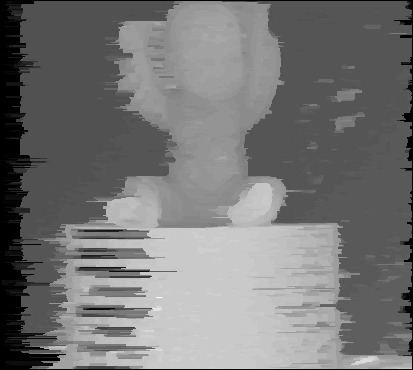

# stereo-match
This is an example of stereo match  based on dp. It is very simple and can only be used for learning
# Dependencies
* OpenCV (3.1+)
* Cmake
# Installation(Tested in Ubuntu 16.04,18.04)
1. Clone this repository via
```bash
git clone https://github.com/Xke1718He/stereo-match.git
```
2. Build
```bash
 mkdir build && cd build
 cmake ..
 make
```
# Run
In build
```bash
./stereo-match 
```
# Reference
[my blog](https://blog.csdn.net/He3he3he/article/details/103599445)
# Results
* left


* right


* result

